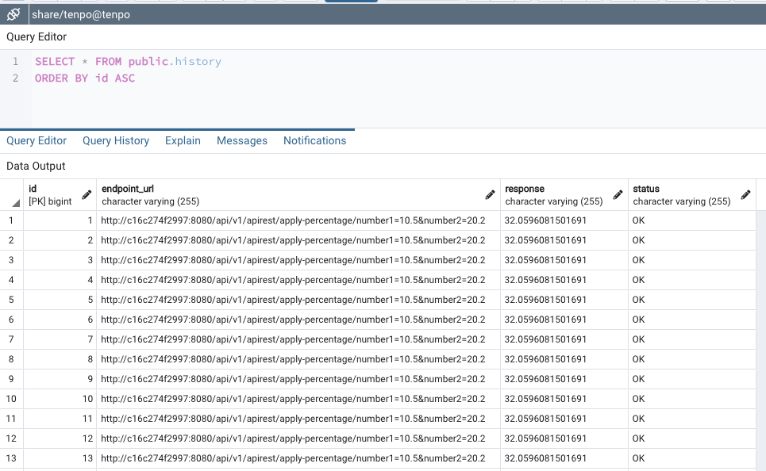
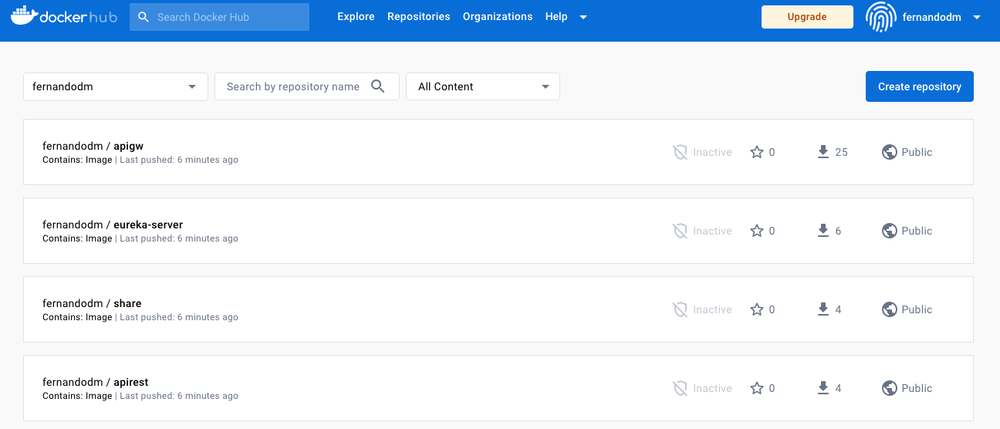
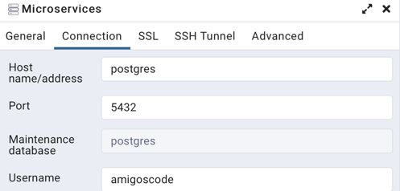
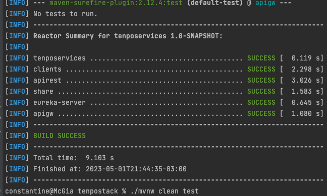
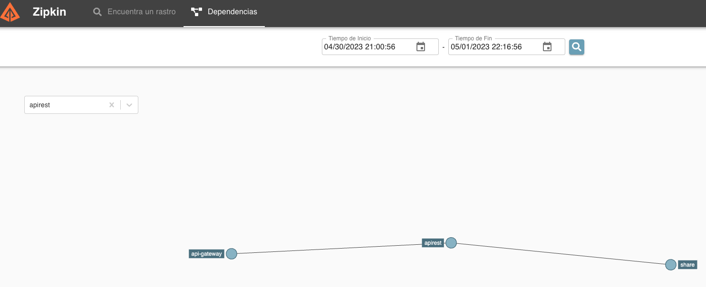

# Tenpo Stack 


# Tenpo Challenge
La solución implementada se encuentra desarrollada en Java 17 e incluye la integración con Eureka para la gestión de servicios. Asimismo, se ha incluido un API Gateway para lograr una mayor agnosticidad en cuanto a los microservicios (API-REST y SHARE).

# Instalacion
Desde IntelliJ corremos algunos servicios del compose que se encuentra en la raiz.
 - tenpodb
 - pgadmintenpo

## Requerimientos

1. Debes desarrollar una API REST en Spring Boot utilizando java 11 o superior, con las siguientes funcionalidades:

   a. Debe contener un servicio llamado por api-rest que reciba 2 números, los sume, y le aplique una suba de un porcentaje que debe ser adquirido de un servicio externo (por ejemplo, si el servicio recibe 5 y 5 como valores, y el porcentaje devuelto por el servicio externo es 10, entonces (5 + 5) + 10% = 11). Se deben tener en cuenta las siguientes consideraciones:
   i. El servicio externo puede ser un mock, tiene que devolver el % sumado.
   ii. Dado que ese % varía poco, podemos considerar que el valor que devuelve ese servicio no va cambiar por 30 minutos.
   iii. Si el servicio externo falla, se debe devolver el último valor retornado. Si no hay valor, debe retornar un error la api.
   iv. Si el servicio falla, se puede reintentar hasta 3 veces.

   b. Historial de todos los llamados a todos los endpoint junto con la respuesta en caso de haber sido exitoso. Responder en Json, con data paginada. El guardado del historial de llamadas no debe sumar tiempo al servicio invocado, y en caso de falla, no debe impactar el llamado al servicio principal.

   c. La api soporta recibir como máximo 3 rpm (request / minuto), en caso de superar ese umbral, debe retornar un error con el código http y mensaje adecuado.

   d. El historial se debe almacenar en una database PostgreSQL.

   e. Incluir errores http. Mensajes y descripciones para la serie 4XX.

2. Se deben incluir tests unitarios.

3. Esta API debe ser desplegada en un docker container. Este docker puede estar en un dockerhub público. La base de datos también debe correr en un contenedor docker. Recomendación usar docker compose

4. Debes agregar un Postman Collection o Swagger para que probemos tu API

5. Tu código debe estar disponible en un repositorio público, junto con las instrucciones de cómo desplegar el servicio y cómo utilizarlo.

6. Tener en cuenta que la aplicación funcionará de la forma de un sistema distribuido donde puede existir más de una réplica del servicio funcionando en paralelo.

---
Solucion comentada:


1. Debes desarrollar una API REST en Spring Boot utilizando java 11 o superior, con las siguientes funcionalidades:

 
   a. Debe contener un servicio llamado por api-rest que reciba 2 números, los sume, y le aplique una suba de un porcentaje que debe ser adquirido de un servicio externo (por ejemplo, si el servicio recibe 5 y 5 como valores, y el porcentaje devuelto por el servicio externo es 10, entonces (5 + 5) + 10% = 11). Se deben tener en cuenta las siguientes consideraciones:

   i. El servicio externo puede ser un mock, tiene que devolver el % sumado.

   ii. Dado que ese % varía poco, podemos considerar que el valor que devuelve ese servicio no va cambiar por 30 minutos.

   iii. Si el servicio externo falla, se debe devolver el último valor retornado. Si no hay valor, debe retornar un error la api.

   iv. Si el servicio falla, se puede reintentar hasta 3 veces.

### Solucion
 - De lo expuesto en el punto 1 y el punto a (y sus sub-items), se solicita crear un ms que se llame apirest, el cual recibira dos nros y llamara a otro servicio
el cual debera devolver un porcentaje, que luego apirest debera tomar para ser sumado.
 - Se solicita que este servicio (puede ser mock, pero en este caso decidí desarrollar un microservicio): **share**
 - Tambien se solicita que cambie poco, por eso se realizo un metodo para que cambie muy lentamente.

```java
private static final Random random = new Random();
private double currentValue = 0.0;

public Double getShare() {
        return currentValue;
        }

// Change value every x miliseconds
// punto a.ii
@Scheduled(fixedRate = 5000)
public void randomizeValue() {
        // increase by a minimu,m of 0.01 every 30 sec
        double randomIncrement = 0.01 + (0.01 * random.nextDouble());

        currentValue += randomIncrement;
        }
```

 - Si el servicio falla se debe devolver el último valor, para este punto pensé en meter un redis, pero iba a llevar mas desarrollo y otro ms mas por eso use de spring el notation de cache
```java
   @Cacheable("randomValue")
   public ShareResponse getShareFromCache() throws ApplyPercentageException {
   try {
   response = retryMethod(3, "getShare", shareClient::getShare); // punto a.iv
   if (response == null || response.shareValue() == 0) {
   throw new ApplyPercentageException("Share Response is null or 0"); // punto a.iii
   }
   } catch (ApplyPercentageException e) {
   throw new ApplyPercentageException("There is no data, please check share-ms" + e.getMessage());
   } finally {
   return response; //punto a.iii ultimo valor retornado
   }
   }
   ```
 - También se solicita que si el servicio falla, se puede reintentar hasta 3 veces, si bien hay librerías como jresilence que hacen CB, decidí crearlo a mano, dado que hace poco lo implemente en un servicio donde no se me deajaba instalar nada por un tema de versiones, claramente en producción Circuit Breaker se adapta mas, tanto para el rate limit como para los reintentos.

```java
public class RetryMethod {
// punto a.iv: Plus agrego un tiempo de espera para no reintentar enseguida
public static <T> T retryMethod(int maxRetries, String functionName, Supplier<T> methodCall) throws Exception {
int retries = 0;
//        Exception lastException = null;
Exception lastException = new RuntimeException("Error occurred during method call");

        while (retries < maxRetries) {
            try {
                return methodCall.get();
            } catch (Exception e) {
                lastException = e;
                log.error("Error calling " + functionName + " on attempt " + retries + " message: " + e.getMessage());
                retries++;
                Thread.sleep(3000L * retries);  // no reintento de una, sino que espero
            }
        }
        log.error("Failed to call " + functionName + " attempts: " + maxRetries + " .Last exception message: " + lastException.getMessage());
        throw lastException;
    }
}
```
- En el punto b se pide: Historial de todos los llamados a todos los endpoint junto con la respuesta en caso de haber sido exitoso. Responder en Json, con data paginada. El guardado del historial de llamadas no debe sumar tiempo al servicio invocado, y en caso de falla, no debe impactar el llamado al servicio principal. 


Para este punto se desarrolló:
```java
    // punto b
    public void saveHistory(Double result, HttpServletRequest request) throws ApplyPercentageException {
        String resultShareValue = result != null ? result.toString() : getShareFromCache().shareValue().toString();
        History history = History.builder()
                .endpointUrl(getParsedUrl(request))
                .response(resultShareValue)
                .status("OK")
                .build();

        try {
            apiRestRepository.save(history);
        } catch (ApplyPercentageException e) {
            throw new ApplyPercentageException("cant save history" + e.getMessage());
        }
    }
```
Para este punto también se desarrolló un endpoint para obtener el historial

### Spoiler:  Llamada al apigw en lugar del servicio directo

```bash
curl -X GET "http://localhost:8083/api/v1/apirest/history?pageNo=0&pageSize=10" |jq
```
        
```json
{
"id": 4,
"endpointUrl": "http://192.168.100.24:8080/api/v1/apirest/apply-percentage/number1=10.5&number2=20.2",
"response": "34.950946908581145",
"status": "OK"
},
{
"id": 5,
"endpointUrl": "http://192.168.100.24:8080/api/v1/apirest/apply-percentage/number1=10.5&number2=20.2",
"response": "34.950946908581145",
"status": "OK"
},
{
"id": 6,
"endpointUrl": "http://192.168.100.24:8080/api/v1/apirest/apply-percentage/number1=10.5&number2=20.2",
"response": "34.950946908581145",
"status": "OK"
},
{
"id": 7,
"endpointUrl": "http://192.168.100.24:8080/api/v1/apirest/apply-percentage/number1=10.5&number2=20.2",
"response": "34.950946908581145",
"status": "OK"
}
```

Puede notarse que no se usaron procesos no bloqueantes, como se solicita (mas abajo detallo).

 - La api soporta recibir como máximo 3 rpm (request / minuto), en caso de superar ese umbral, debe retornar un error con el código http y mensaje adecuado.

```java
   @PostMapping("/apply-percentage")
   @RateLimiter(name = "rateLimiter", fallbackMethod = "customFallback")//punto c
   public ResponseEntity<ShareResponse> applyPercentage(@RequestParam("number1") double number1,
   @RequestParam("number2") double number2) throws ApplyPercentageException {

        if (number1 <= 0 || number2 <= 0)
            throw new ApplyPercentageException("Please provide valid numbers for applyPercentage operation: " + number2);

        log.info("appliying percentage to {}", number1 + number2);
        ShareResponse result = apiRestService.applyPercentage(number1, number2);
        apiRestService.saveHistory(result.shareValue(), request);
        return ResponseEntity.ok(result);
   }
```
 - Ver que si uso el servicio directo el rate limiter funciona perfecto, pero por alguna razón con el stack completo hace un by-pass y no toma la restricción.


 - El historial se debe almacenar en una database PostgreSQL.


 - Incluir errores http. Mensajes y descripciones para la serie 4XX.

Para este punto se crearon las excepciones específicas para cada caso (ver carpeta exceptions)


 - Tests unitarios incluidos.

 - Esta API debe ser desplegada en un docker container. Este docker puede estar en un dockerhub público. La base de datos también debe correr en un contenedor docker. Recomendación usar docker compose

Para este punto se trabajó con perfiles, el perfil para desarrollo es prod o dev, pero el perfil docker es el solicitado para desplegar todo orquesta en containers.
También se subió todo a un repo como se solicitó (antes buildear la solución siguiendo los pasos más abajo comentados)
```
https://hub.docker.com/repositories/fernandodm
```



 - Debes agregar un Postman Collection o Swagger para que probemos tu API.

Más abajo proveo los curls para probar


 - Tu código debe estar disponible en un repositorio público, junto con las instrucciones de cómo desplegar el servicio y cómo utilizarlo.
```
https://github.com/fernando-dm/tenpo-challenge.git
```

 - Tener en cuenta que la aplicación funcionará de la forma de un sistema distribuido donde puede existir más de una réplica del servicio funcionando en paralelo.

Con base a este último punto es que arme el stack, dado que ya he probado que con un apigw y eureka se puede crear una replica que luego resuelve mediante un load balance.


## NOTAS y alcance:

---
**NOTA:**
Debido al tiempo limitado para completar el ejercicio solicitado, no pude abordar ciertos puntos en profundidad. Sin embargo, hice mi mejor esfuerzo para proveer la mejor solución posible en el plazo asignado. Agradezco su comprensión y estoy a disposición para cualquier aclaración o comentario adicional.
---

TODO RateLimiter y procesos no bloqueantes.

______

**DEPLOY:**

1) ver que si usamos localhost en host es para levantar desde el IDE, si es con docker, poner POSTGRES que es el nombre del servicio
2) levantar postgres, y crear las bases a mano.
3) usar el nombre del servicio si ya levante por compose 
4) se debe ejecutar: Zipkin, Eureka, tenpodb y cada uno de los servicios: api-rest y share 
5) En base al punto 6 donde se solicita que se pueda escalar con dockers, por eso la eleccion del stack cloud 


De esta forma tendremos acceso a ver la db y crear el schema correspondiente

<pre><code>
CREATE DATABASE tenpo
    WITH 
    OWNER = tenpo
    ENCODING = 'UTF8'
    LC_COLLATE = 'en_US.utf8'
    LC_CTYPE = 'en_US.utf8'
    TABLESPACE = pg_default
    CONNECTION LIMIT = -1;
</code></pre>

### Creo wrapper para la app
```bash
mvn -N wrapper:wrapper
```

# docker mode
Compilar la solución usando el plugin jib, ver que comenté el código para que use telmurin latest, la otra no me andaba.

### Creo wrapper para la app
```bash
mvn -N wrapper:wrapper
```

### El compose para que apunte a mi repo de dockerhub (registry) es el de perfil: docker

```yaml
$: docker-compose.yaml
```

```dockerfile
  eureka-server:
    image: fernandodm/eureka-server:1.0-SNAPSHOT        // como se solicita en el punto 5
    container_name: eureka-server
    ports:
      - "8761:8761"
    environment:
      - SPRING_PROFILES_ACTIVE=docker  *** ver perfil docker
    networks:
      - spring
    depends_on:
      - zipkin
```


### Buildeo las imagenes
Esto baja las imagenes de mi repo publico
Desde la raiz ejecutar
```shell
docker login registry-1.docker.io
```

```shell
# buildeamos desde la raiz (una vez descargado el proyecto)
./mvnw -P build-docker-image clean install
```

### Otras Opciones de buildeo, si hay problemas
```shell
./mvnw -ntp -P build-docker-image clean package -Djib.to.auth.username=fernandodm -Djib.to.auth.password=Password

mvn compile com.google.cloud.tools:jib-maven-plugin:3.2.0:build -Dimage=registry.hub.docker.com/fernandodm/jib-spring-boot-app2
mvn compile com.google.cloud.tools:jib-maven-plugin:3.2.0:build -Dimage=<MY IMAGE>
```

### Limpio y fuerzo a bajar libs en caso de error **
```bash
./mvnw dependency:purge-local-repository -DmanualInclude=com.tenpo
docker-compose up --remove-orphans
```

### Si quiero levantar local
<code>
    docker-compose up postgres zipkin rabbitmq
<code>

(Luego levanto por IDE cada servicio):

## test
Puedo correr los test desde línea de comando:

<code>
tenpostack % ./mvnw clean test
<code>


###


### Prueba endpoint directo
Api directo al apigtw

    curl -X POST -d "number1=10.5&number2=20.2" http://localhost:8083/api/v1/apirest/apply-percentage 

Api directo al servicio:

    curl -X POST -d "number1=10.5&number2=20.2" http://localhost:8080/api/v1/apirest/apply-percentage 

Prueba para probar la escalabilidad y ver como apigtw redirige a api-rest (indistintamente la instancia)

    while true; do curl -X POST -d "number1=10.5&number2=20.2" http://localhost:8083/api/v1/apirest/apply-percentage |jq;done

** por alguna razon aun no logre con este proyecto que escale

### Base H2
Esta embebida en el repo y se auto-crea

    tenpostack/dbinmemory


### Levanto todo con compose
```shell
docker-compose up -d --remove-orphans 
```
Ver que automaticamente levanta todo en detach

### Para ver los logs de cada ms

<code>

    docker logs -f apigw 
    
    docker logs -f apirest
    
    docker logs -f share 
    
    docker logs -f apigw 

    docker logs -f eureka-server

<code>


# Para ver como se ejecuta cada ms 
### Eureka:

http://localhost:8761

### actuator de eureka

http://localhost:8761/actuator/

### Zipkin

http://localhost:9411/



### portainer
Instalar portainer para ver el stack (opcional)

docker volume create portainer_data
docker run -d --detach -p 8000:8000 --publish 9000:9000 -p 9443:9443 --name=portainer --restart=always -v /var/run/docker.sock:/var/run/docker.sock -v portainer_data:/data portainer/portainer-ce

Portainer: https://localhost:9443


### pgadmin

http://localhost:5050/browser/
